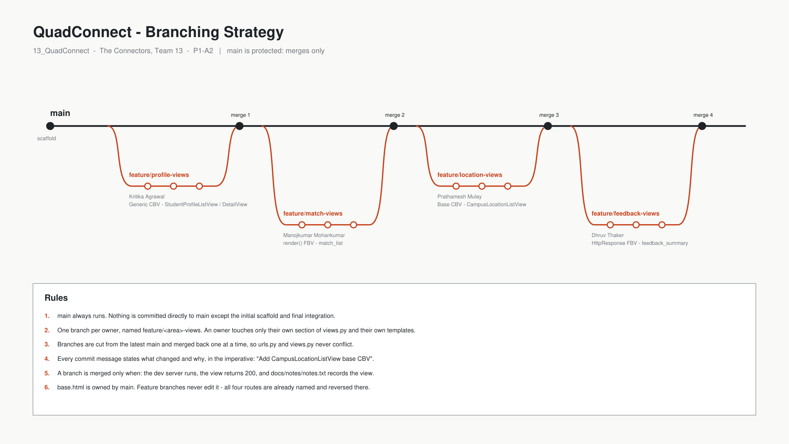

# Branching Strategy



## Model

A short-lived **feature-branch** model off a protected `main`. There is no
long-running `develop` branch: the team is four people on a one-semester
project, and a second permanent branch would add merge overhead without
buying isolation we actually need.

```
main ──●──────────●──────────●──────────●──────────●
        \        / \        / \        / \        /
         profile╯   match ╯   location╯  feedback╯
```

## Branch naming

```
feature/<area>-views      work for P1-A2
feature/<area>-<thing>    later assignments
fix/<short-description>   bug fixes
docs/<short-description>  documentation-only changes
```

Lowercase, hyphen-separated, no personal names in the branch — the owner is
visible from the commit author, and naming by area keeps branches meaningful
after the person moves on to something else.

## Ownership

Each member owns one feature area for the whole semester, so branches rarely
touch the same files.

| Branch | Owner | Scope |
|---|---|---|
| `feature/profile-views` | Kritika Agrawal | Generic CBV — students |
| `feature/match-views` | Manojkumar Mohankumar | `render()` FBV — matches |
| `feature/location-views` | Prathamesh Mulay | Base CBV — campus locations |
| `feature/feedback-views` | Dhruv Thaker | `HttpResponse` FBV — feedback |

## Rules

1. **`main` always runs.** Nothing is committed directly to `main` except the
   initial scaffold and the final integration commit.
2. **Cut from the latest `main`.** `git switch main && git pull` first, always.
3. **Merge one branch at a time.** Sequential integration is why `urls.py` and
   `views.py` never conflict, even though all four branches touch them.
4. **Stay in your section.** `views.py` is divided into commented sections, one
   per owner. Do not edit another owner's section, even to fix something —
   raise it in the group chat instead.
5. **`base.html` belongs to `main`.** All four routes are already named and
   reversed there, so feature branches never need to touch it. This is the
   single biggest conflict source we designed out.
6. **Commit messages are imperative and specific.**
   `Add CampusLocationListView base CBV` — not `update`, `fix`, `changes`.
7. **Definition of done** before merging: the dev server starts, the view
   returns HTTP 200, the empty state renders, and `docs/notes/notes.txt`
   records the view's name, type and purpose.

## Merge procedure

```bash
# On your feature branch, make sure it is current with main
git switch main
git pull
git switch feature/<your-branch>
git merge main            # resolve anything here, not on main

# Push and open a pull request against main
git push -u origin feature/<your-branch>
```

The repository owner merges the pull request. We use PRs rather than direct
merges so that every change has a visible review point in the history, which
is what the assignment asks the instructor to evaluate.

## Why not trunk-based with direct commits?

Four people learning Django on the same small app will break `main` if they
push straight to it, and a broken `main` blocks everyone. Feature branches
cost one extra command and keep the demo working at all times.
